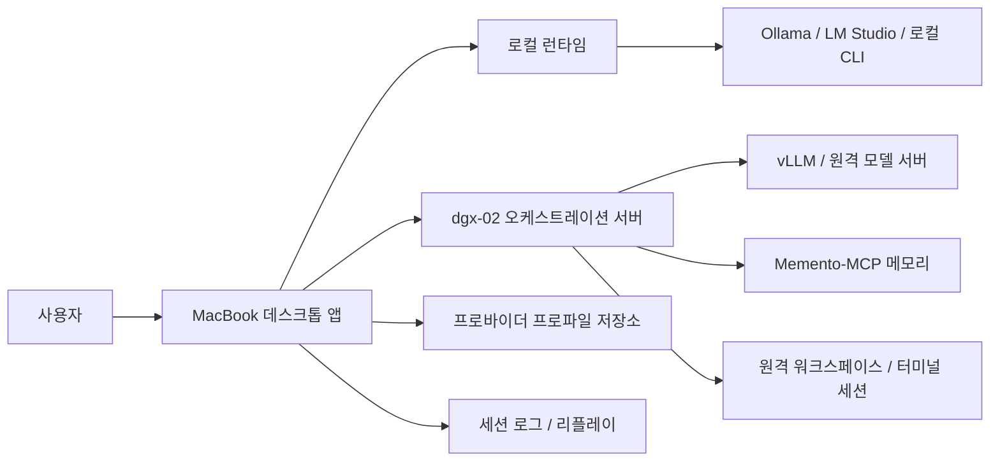

# 아키텍처

## 전체 구조

## 데스크톱 앱

데스크톱 앱은 사용자가 실제로 보는 지휘실이다. 모델 선택, 프로바이더 프로파일 관리, 토론 패널, 코딩 전달, 터미널 세션, 메모리 조회, 실행 리플레이를 담당한다.

예상 기술 스택은 Tauri 또는 Electron + React + TypeScript다. 로컬 시스템 접근과 맥북 배포 안정성을 고려해 초기에는 Tauri를 우선 검토한다.

## dgx-02 서버

`dgx-02`는 무거운 작업을 담당한다.

- 원격 모델 실행
- 멀티 에이전트 라운드 관리
- 장기 메모리 서버
- 원격 워크스페이스 실행
- 로그 저장 및 검색
- 비용/토큰/속도 집계

서버는 FastAPI 또는 Node 기반 서버로 시작할 수 있다. 모델 서버가 Python 생태계와 가까우면 FastAPI가 유리하고, 데스크톱과 타입 공유를 강하게 가져가려면 Node 계열이 유리하다.

## 로컬 폴백

서버가 꺼져 있거나 네트워크가 불안정하면 데스크톱 앱은 다음 기능만 활성화한다.

- 로컬 모델 토론
- 로컬 CLI 에이전트 실행
- 로컬 세션 로그
- 로컬 프로바이더 프로파일
- 캐시된 메모리 검색

다음 기능은 제한된다.

- DGX 원격 모델
- 중앙 Memento 메모리 업데이트
- 원격 워크스페이스 실행
- 서버 기반 비용 집계

## 통신 방식

- 데스크톱과 서버: WebSocket + HTTP API
- 긴 실행 로그: streaming event
- 터미널: PTY 스트림
- 에이전트 실행: job id 기반 비동기 실행
- 메모리: recall/remember/reflect API

## 패키지 경계

- `packages/protocol`: 모든 이벤트와 요청/응답 스키마
- `packages/providers`: 모델 프로바이더별 어댑터
- `packages/agents`: 에이전트 런타임과 토론 엔진
- `apps/desktop`: UI와 로컬 런타임 연결
- `apps/server`: DGX 서버와 원격 실행 계층
